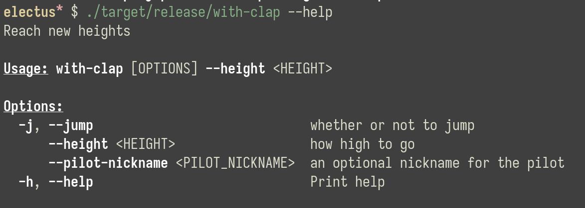

Compare Rust CLI parsing libs
===============================================================================

Executable binary size
-------------------------------------------------------------------------------

| size | crate     | profile |
|------|-----------|---------|
| 448K | with-argh | release |
| 1.1M | with-clap | release |
| 4.5M | with-argh | debug   |
| 14M  | with-clap | debug   |

Help
-------------------------------------------------------------------------------

### clap

Both `-h` and `--help`:

### argh

Only `--help`:

Warnings for unused parameters
-------------------------------------------------------------------------------

### clap

None.

### argh

    warning: fields `jump`, `height`, and `pilot_nickname` are never read
      --> pkgs/argh/src/main.rs:8:5
       |
    5  | struct Cli {
       |        --- fields in this struct
    ...
    8  |     jump: bool,
       |     ^^^^
    ...
    12 |     height: usize,
       |     ^^^^^^
    ...
    16 |     pilot_nickname: Option<String>,
       |     ^^^^^^^^^^^^^^
       |
       = note: `Cli` has a derived impl for the trait `Debug`, but this is intentionally ignored during dead code analysis
       = note: `#[warn(dead_code)]` on by default

    warning: `with-argh` (bin "with-argh") generated 1 warning
        Finished dev [unoptimized + debuginfo] target(s) in 0.00s
